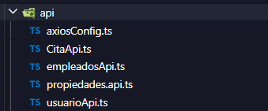
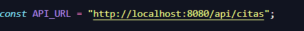
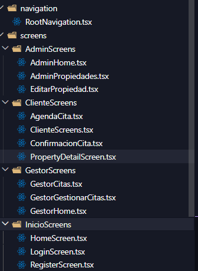
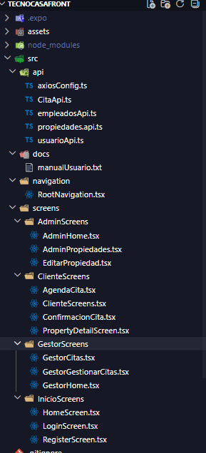

# Proyecto TecnoCasa Frontend

Esta aplicación móvil fue desarrollada utilizando las tecnologías de React Native y Expo. El proyecto se centra en una inmobiliaria, permitiendo gestionar propiedades y citas según el rol del empleado: Gestor o Administrador.

# Descripcion

La aplicación está enfocada en una inmobiliaria llamada Tecnocasa y cubre las siguientes funcionalidades:

* Visualización de propiedades.
* Gestión de citas por parte de los gestores.
* Modificación de propiedades por los administradores.
* Sistema de inicio de sesión basado en roles.
* Una interfaz atractiva y fácil de usar.

# Funciones principales de la APP

## Autenticacion y roles

- **Login** - Usuario / Contraseña
* Redirecccion automatica segun el tipo de rol:
  - **Admin** → Panel de administración
  - **Gestor** → Panel de gestor
  - **Cliente** → Panel de cliente

  ### Rol del Administrador

  - Ver y modificar las propiedades
  - Cierre de sesion

  ### Rol del Gestor
  - Ver citas asignadas al gestor
  - Ver detalle de cada cita
  - **Confirmar cita**
  - **Cancelar cita** (cambia estado, no elimina)
  - Cerrar sesión

  ### Rol del Cliente
  - Ver listado de propiedades
  - Crear cita asociada a una propiedad
  -  Cerrar sesión

  # Tecnologias utilizadas para la APP

  - **React Native**
- **Expo**
- **TypeScript**
- **Axios**
- **React Navigation (Stack)**
- **StyleSheet** para estilos
- Assets personalizados (fondos, imágenes)

# Requesitos previos para la APP

- Node.js instalado
- Expo CLI (opcional, se puede usar `npx`)
- Emulador Android/iOS o app **Expo Go** en el móvil
- Backend de TecnoCasa corriendo (Spring Boot en `http://localhost:8080` o IP local)

# Configuración de la APP

### 1.- Instalacion de dependencias
        npm install

### 2.- Configuracion de la conexion.

Si usas emulador Android: suele funcionar http://10.0.2.2:8080/api

Si usas móvil físico: cambia localhost por tu IP local, por ejemplo:
**const API_URL = "http://192.168.1.50:8080/api";**

### 3.- Arrancar la APP
**npx expo start**

# Navegaciones y pantallas

# Estructura del proyecto

# AUTOR
**GABRIEL DAVID GELVIZ MONTERREY**

[Manual de Usuario](src/docs/manualUsuario.txt)